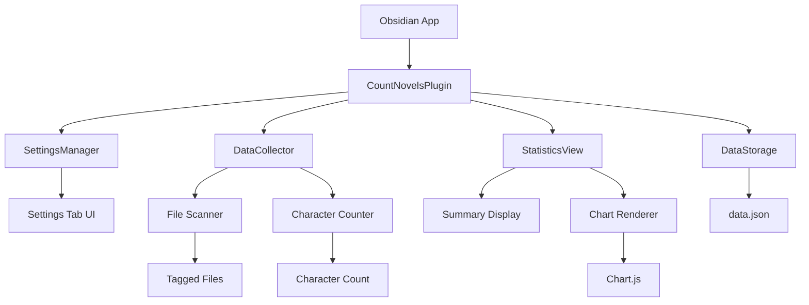

# 設計書

## 概要

count-novelsプラグインは、Obsidianで執筆する小説家向けの進捗トラッキングツールです。指定されたタグを持つファイルの文字数を定期的に集計し、日々の執筆量をグラフで可視化します。既存のプラグイン基盤を活用し、シンプルで効率的な実装を目指します。

## アーキテクチャ

### システム構成図



### レイヤー構成

1. **プレゼンテーション層**
   - 設定タブ（CountNovelsSettingTab）
   - 統計ビュー（CountNovelHome）
   - グラフ表示コンポーネント

2. **ビジネスロジック層**
   - データ収集サービス（DataCollectionService）
   - 統計計算サービス（StatisticsService）
   - ファイルスキャナー（FileScanner）

3. **データアクセス層**
   - データストレージ（DataStorage）
   - 設定管理（SettingsManager）

## コンポーネントとインターフェース

### 1. メインプラグインクラス（CountNovelsPlugin）

既存のクラスに最小限の機能を追加：

```typescript
interface CountNovelsPlugin {
  // 既存機能
  settings: CountNovelsSettings;
  onload(): Promise<void>;
  
  // 新規追加（シンプル実装）
  collectData(): Promise<void>;
  intervalId?: number;
}
```

### 2. 設定管理（CountNovelsSettings）

```typescript
interface CountNovelsSettings {
  logLevel: string;
  trackingTag: string; // 新規追加：集計対象タグ（デフォルト: "novel"）
}
```

### 3. 統計ビュー（CountNovelHome）

既存のビューを拡張し、シンプルな表示：

```typescript
interface CountNovelHome extends ItemView {
  renderStats(): void; // サマリーとグラフを一緒に表示
  chartInstance?: Chart;
}
```

## データモデル

### 1. プラグインデータ構造（シンプル版）

```typescript
interface PluginData {
  settings: CountNovelsSettings;
  lastTotalCharacterCount: number;
  dailyStats: Record<string, number>; // "YYYY-MM-DD" -> 文字数差分
}
```

AGENTS.mdの仕様通り、data.jsonに保存する最小限のデータ構造です。

## エラーハンドリング

### 1. ファイルアクセスエラー

- ファイルが削除された場合：警告ログを出力し、集計から除外
- ファイルが読み取り不可の場合：エラーログを出力し、前回の値を使用

### 2. データ保存エラー

- data.json保存失敗：エラーログを出力し、メモリ内データを保持
- データ破損：バックアップから復元、不可能な場合は初期化

### 3. UI表示エラー

- Chart.js読み込み失敗：テキストベースの統計表示にフォールバック
- データ不足：「データがありません」メッセージを表示

## テスト戦略（MVP版）

### 手動テスト

- **基本機能**: プラグイン有効化、設定変更、データ収集、ビュー表示
- **データ確認**: data.jsonの内容が正しく保存されているか
- **グラフ表示**: Chart.jsが正常に動作するか

自動テストは後のバージョンで追加予定。

## MVP実装方針

### シンプル化の原則

- **最小限の機能**: 文字数集計、基本的なグラフ表示、設定のみ
- **エラーハンドリング**: 基本的なtry-catchのみ、詳細なエラー処理は後回し
- **最適化**: 初期バージョンでは性能最適化は行わない
- **テスト**: 手動テストのみ、自動テストは後のバージョンで追加

## 実装の技術的詳細

### 1. 文字数カウント方法（シンプル版）

```typescript
function countCharacters(content: string): number {
  // MVPでは単純な文字数カウント
  return content.length;
}
```

### 2. Chart.js設定（シンプル版）

```typescript
const chartConfig: ChartConfiguration = {
  type: 'bar',
  data: {
    labels: [], // 日付ラベル
    datasets: [{
      label: '執筆文字数',
      data: [], // 文字数差分（正負両方）
      backgroundColor: 'rgba(54, 162, 235, 0.8)',
    }]
  },
  options: {
    responsive: true,
    scales: {
      y: {
        beginAtZero: true
      }
    }
  }
};
```

### 3. 定期実行（シンプル版）

```typescript
// メインプラグインクラス内で直接実装
this.intervalId = window.setInterval(() => {
  this.collectData();
}, 10 * 60 * 1000); // 10分間隔
```